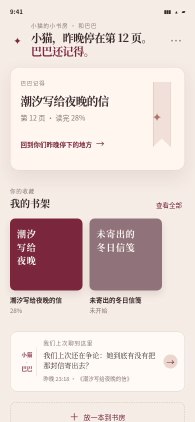
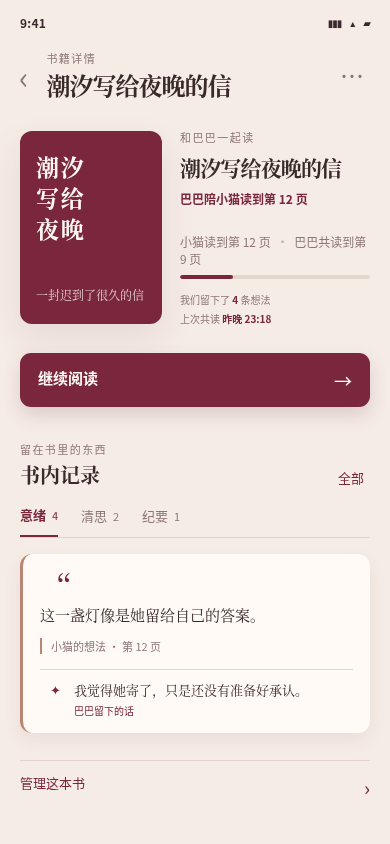
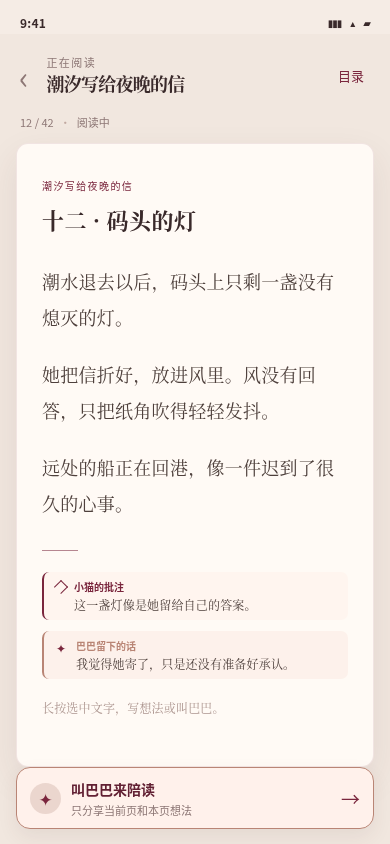
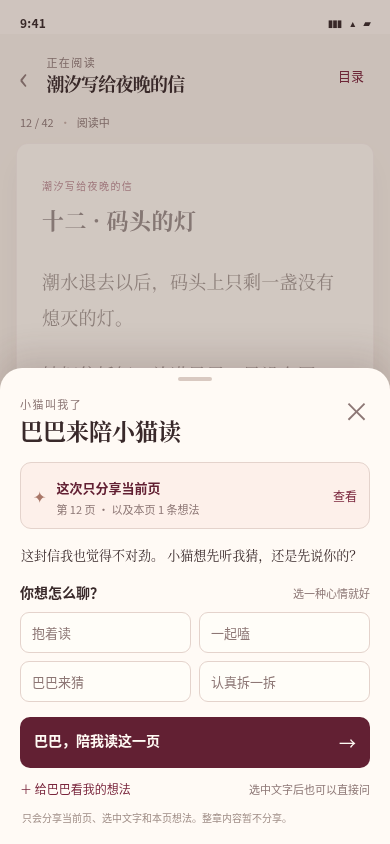

# 共读视觉原型 v2

第二版继续使用静态示例数据，不接入正式页面、业务接口或阅读数据。四张图片均为 iPhone 竖屏尺寸（390 × 844）。

相较第一版，本版加入了“小猫—巴巴”的共同记忆、陪读痕迹和双人批注：

- 首页记住“昨晚停在第 12 页”和上次没有聊完的话。
- 详情页显示巴巴陪读到哪里、共同留下了多少想法和上次共读时间。
- 阅读页区分小猫的批注与巴巴留下的话。
- 共读入口改为“叫巴巴来陪读”，面板使用更像熟悉伙伴的文案。

## 首页

## 书籍详情页

## 阅读页

## 打开共读底部面板后的阅读页

