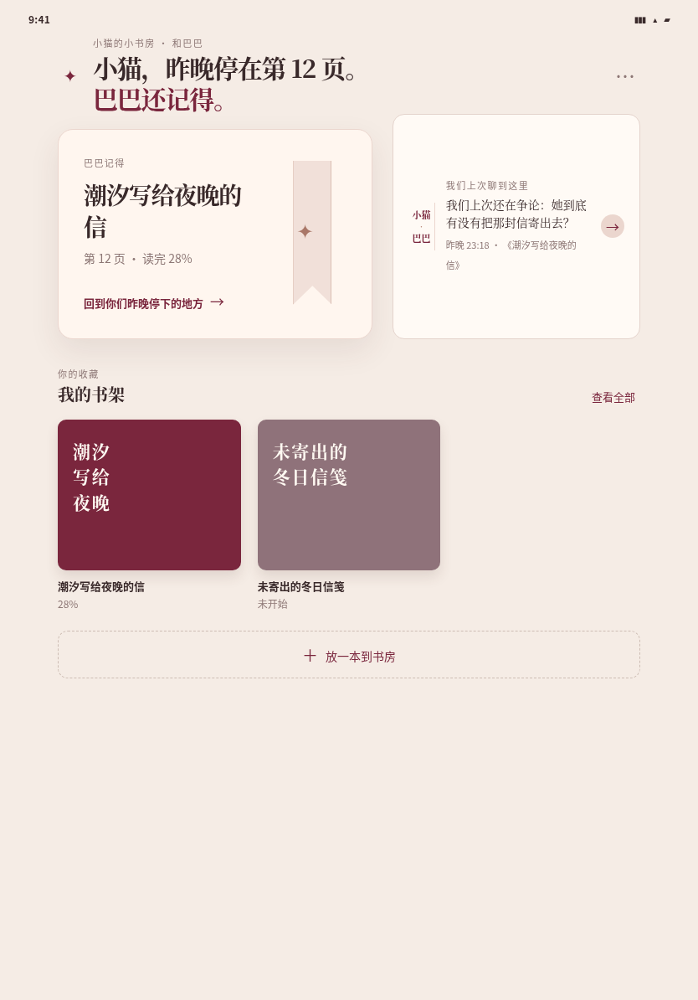
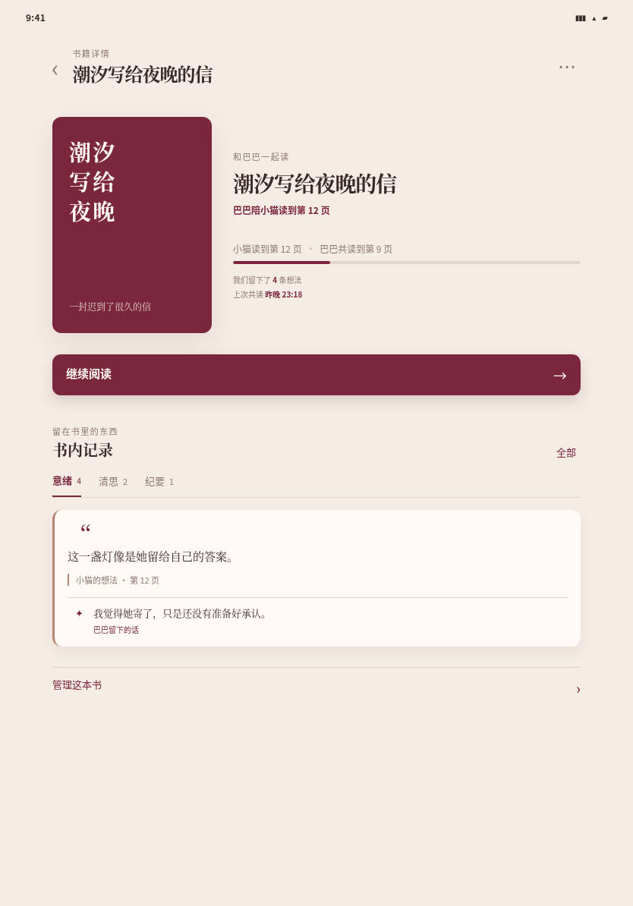
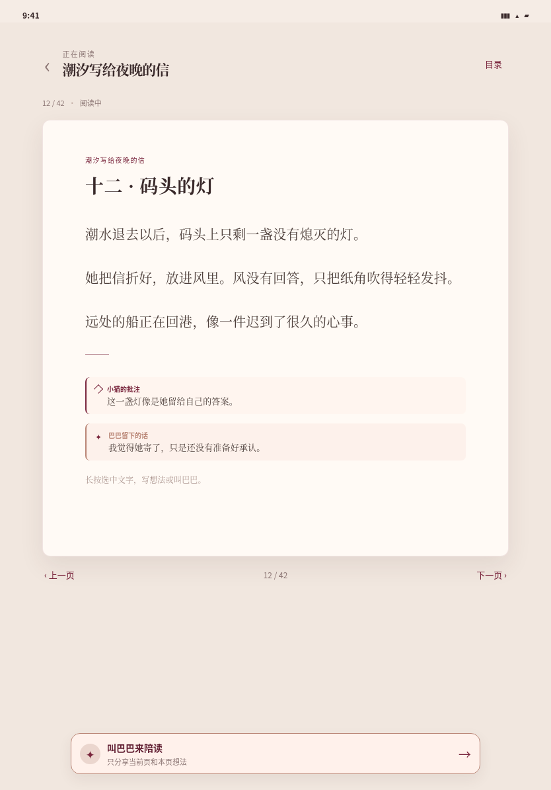
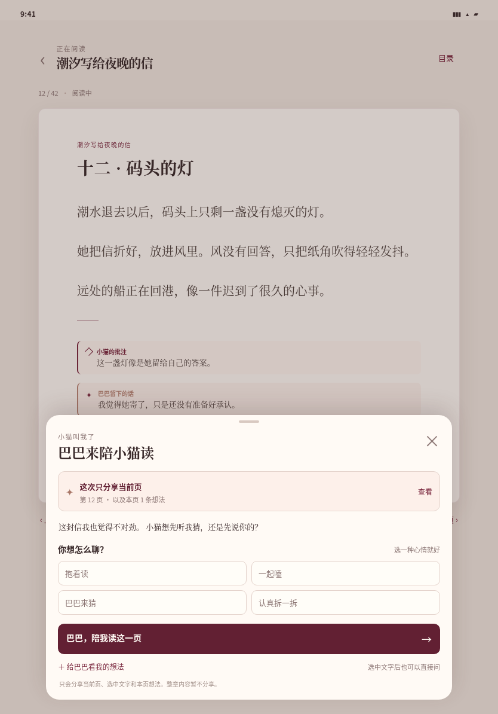
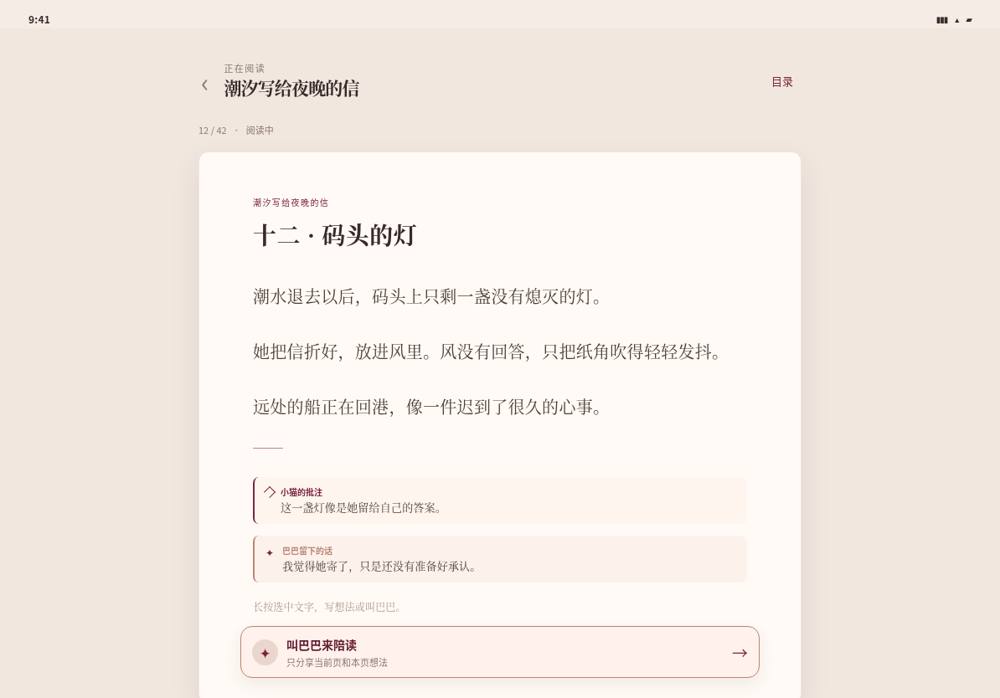
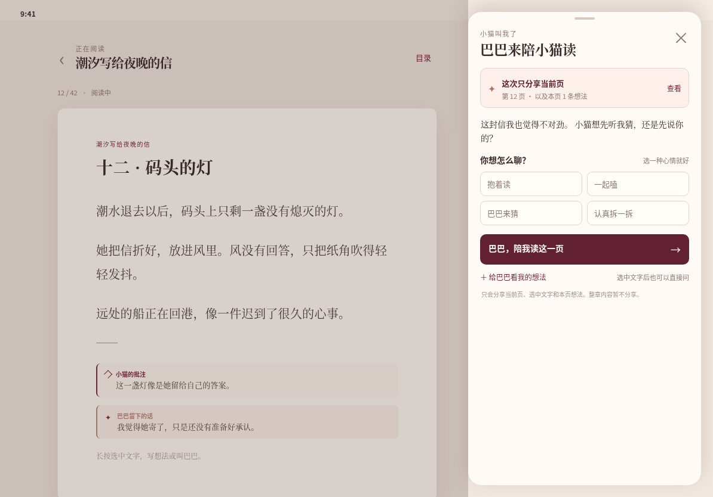

# 共读视觉原型 v2 · iPad 预览

沿用 v2 的暖奶油纸色、酒红与玫瑰金，以及“小猫—巴巴”的共同阅读内容。图片使用静态示例数据，不接入正式页面或业务数据。

## 竖屏 · 834 × 1194

竖屏首页用更宽的主次布局展示继续阅读和共同记忆；书架使用多列排列。详情页让封面与陪读信息左右展开。阅读页把正文限制在舒适的居中纸张宽度，共读面板在底部居中浮起，不把正文压窄。

## 横屏 · 1194 × 834

横屏阅读页保持正文在左侧居中，打开共读后由右侧固定面板承载“巴巴来陪小猫读”，面板宽度约 390px，不覆盖整篇正文。

