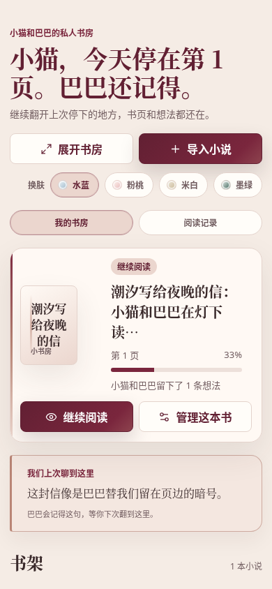
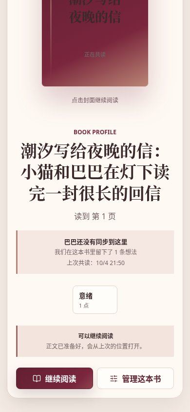
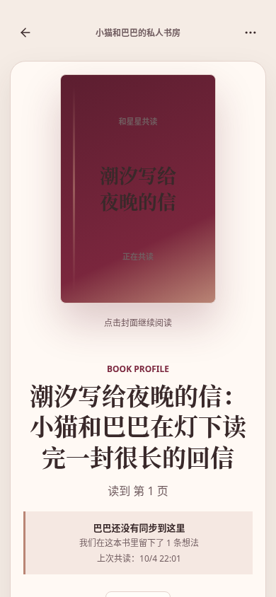
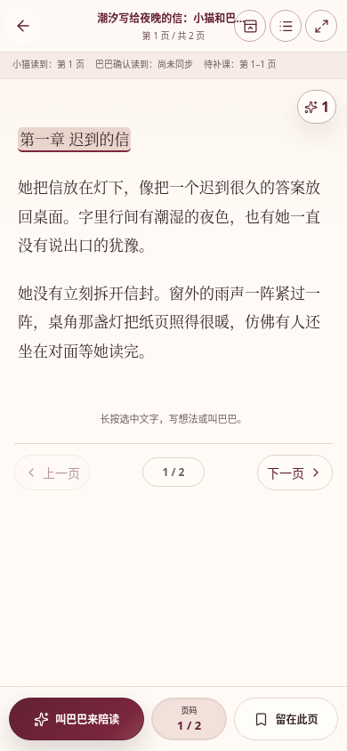
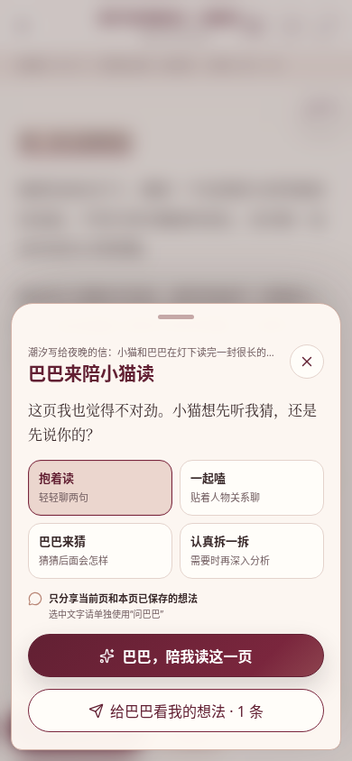
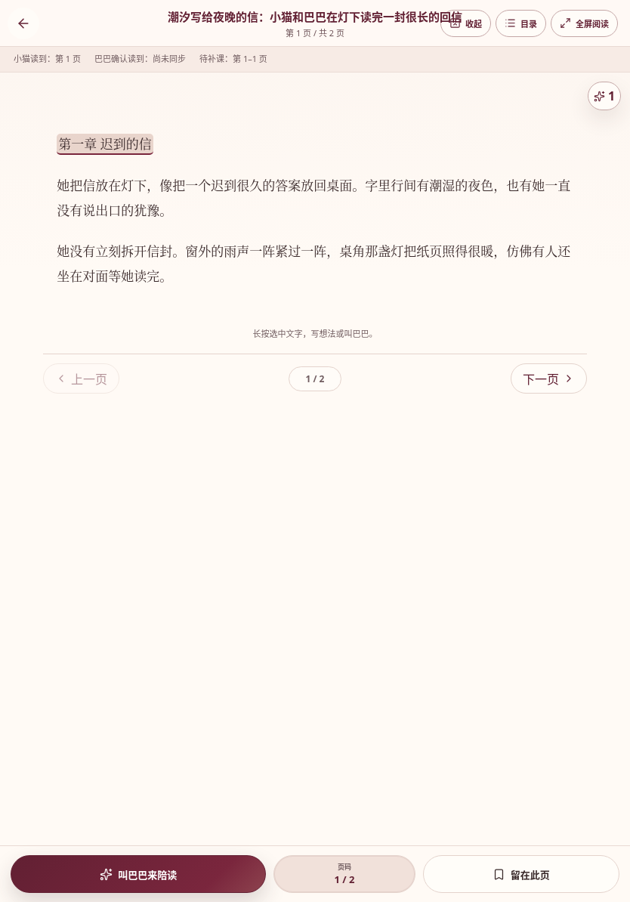
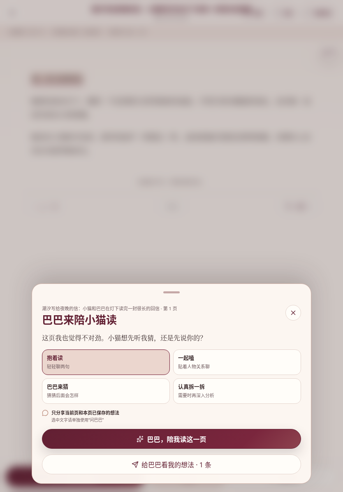
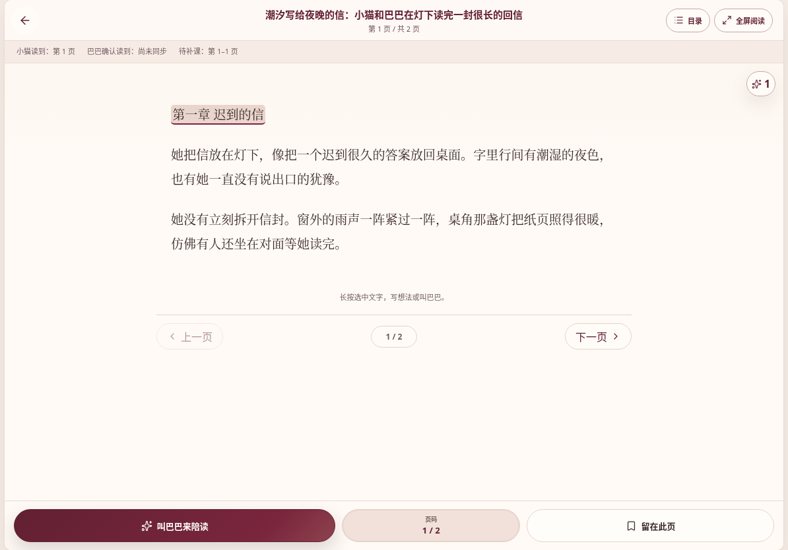
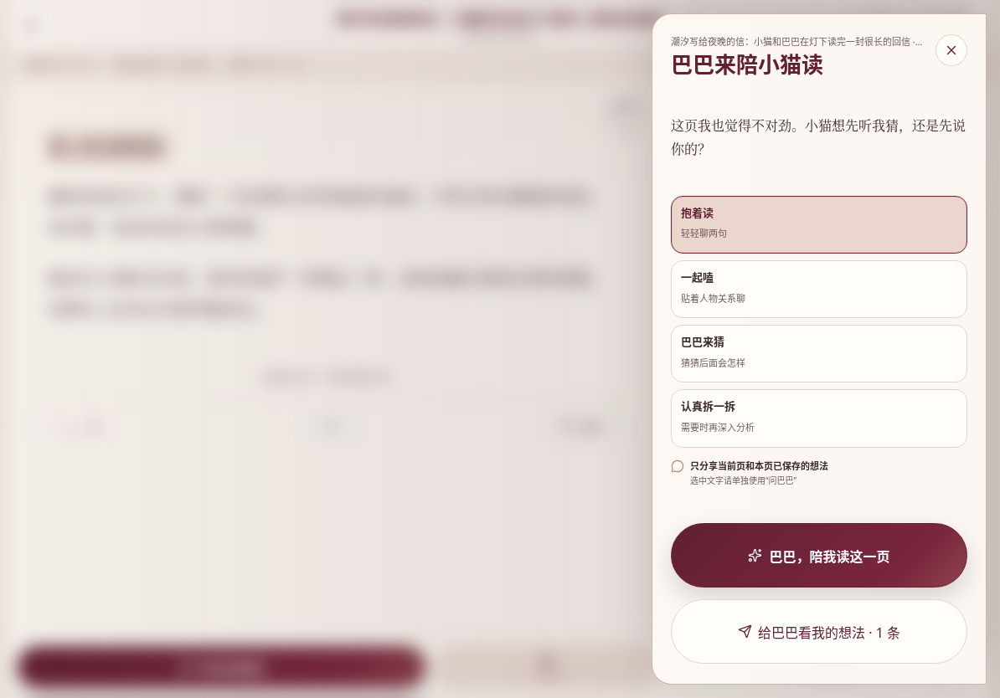
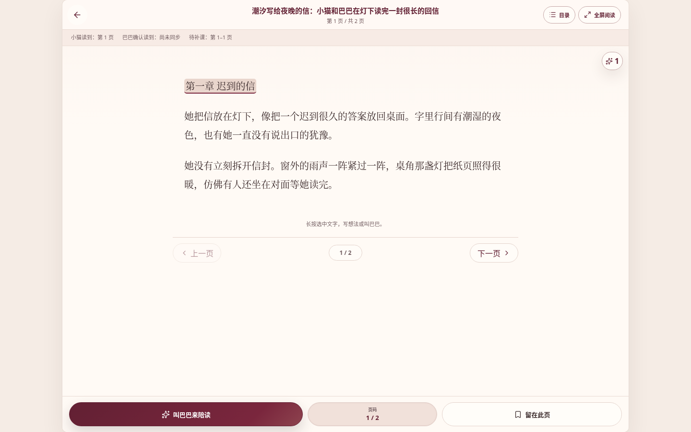

# 正式应用运行预览

这里的图片来自当前分支正式应用的 `web/dist` 构建，并由浏览器实际打开应用后截取；没有复用静态视觉原型图片。

## 测试数据

- 书名：潮汐写给夜晚的信：小猫和巴巴在灯下读完一封很长的回信
- 内容：3 个示例段落，当前阅读位置为第 1 页
- `lastReadAt`：截图时写入的当前时间，因此首页显示“今天”
- 本页已保存 1 条想法，详情页的 `assistantSyncedPosition` 保持为空，因此显示“巴巴还没有同步到这里”
- 截图包含首页、书籍详情、阅读页和手动共读面板；共读面板使用真实应用交互打开

## iPhone（390 × 844）

## iPad 竖屏（834 × 1194）

## iPad 横屏（1194 × 834）

## 桌面端（1440 × 900）

